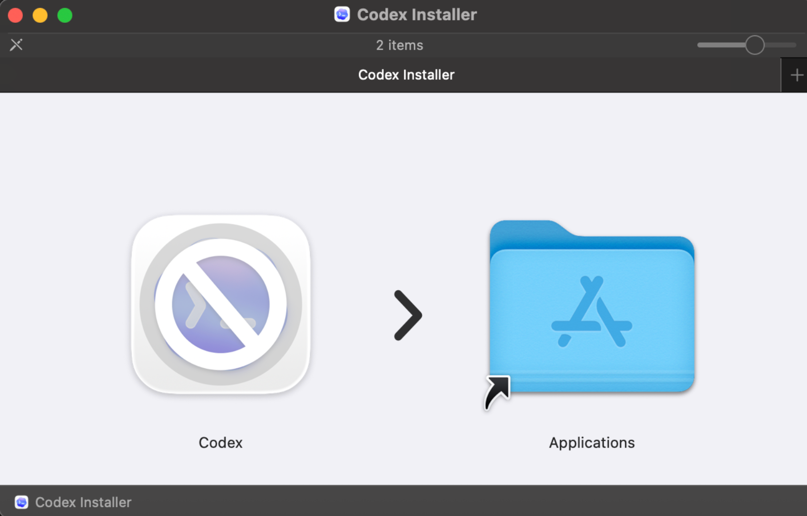

# Codex auf Intel-Macs zum Laufen bringen (Inoffiziell)

## Das Problem

Die offizielle Codex-App von OpenAI wird ausschliesslich als ARM-Binary (Apple Silicon) ausgeliefert. Wer noch einen Intel-basierten Mac nutzt, bekommt beim Versuch die App zu starten nur das hier zu sehen:



Das Verbotszeichen auf dem App-Icon bedeutet: **macOS kann diese App auf deiner Hardware nicht ausfuehren.**

## Die Loesung

Dieses Repository stellt ein Build-Script bereit, das aus dem originalen `Codex.dmg` ein Intel-kompatibles App-Image erzeugt. Die originale DMG-Datei bleibt dabei vollstaendig unberuehrt -- es wird lediglich eine neue, fuer x86_64 gebaute Version erstellt.

## Inhalt des Repos

| Datei | Beschreibung |
|---|---|
| `build-intel.sh` | Das zentrale Build-Script, das die Konvertierung durchfuehrt |
| `package.json` | Optionaler npm-Wrapper (`npm run build`) |
| `.gitignore` | Schliesst Build-Artefakte und temporaere Dateien aus |

## Voraussetzungen

- macOS (Intel oder Apple Silicon mit Rosetta)
- Standardwerkzeuge: `bash`, `hdiutil`, `ditto`, `codesign`
- Node.js und npm (werden vom Script genutzt um Electron und weitere Abhaengigkeiten herunterzuladen)

## Anleitung

**Schritt 1** -- Lege deine originale `Codex.dmg` im uebergeordneten Verzeichnis ab (also *neben* dem Repo-Ordner, nicht darin), sodass sie unter `../Codex.dmg` erreichbar ist.

**Schritt 2** -- Fuehre das Build-Script aus:

```bash
chmod +x ./build-intel.sh
./build-intel.sh
```

Alternativ kannst du auch einen expliziten Pfad zur DMG angeben:

```bash
./build-intel.sh /pfad/zur/Codex.dmg
```

Oder ueber npm:

```bash
npm run build
```

## Was passiert im Hintergrund?

Das Script erledigt automatisch folgende Schritte:

1. Mountet die originale DMG im Nur-Lesen-Modus
2. Extrahiert die App und erkennt die verwendete Electron-Version
3. Laedt eine x64-Version von Electron herunter
4. Baut native Module (`better-sqlite3`, `node-pty`) fuer Intel neu
5. Ersetzt die ARM-Binaries durch die x64-Varianten
6. Signiert die App ad-hoc fuer die macOS-Integritaetspruefung
7. Erzeugt das fertige `CodexAppMacIntel.dmg`

## Ergebnis

| Ausgabe | Beschreibung |
|---|---|
| `CodexAppMacIntel.dmg` | Die fertige Intel-kompatible Codex-App |
| `log.txt` | Vollstaendiges Build-Protokoll |
| `.tmp/` | Temporaeres Arbeitsverzeichnis (kann nach erfolgreichem Build geloescht werden) |

## Probleme?

Falls etwas nicht funktioniert, wirf zuerst einen Blick in die `log.txt`. Dort findest du detaillierte Informationen zu jedem Schritt des Build-Prozesses.
